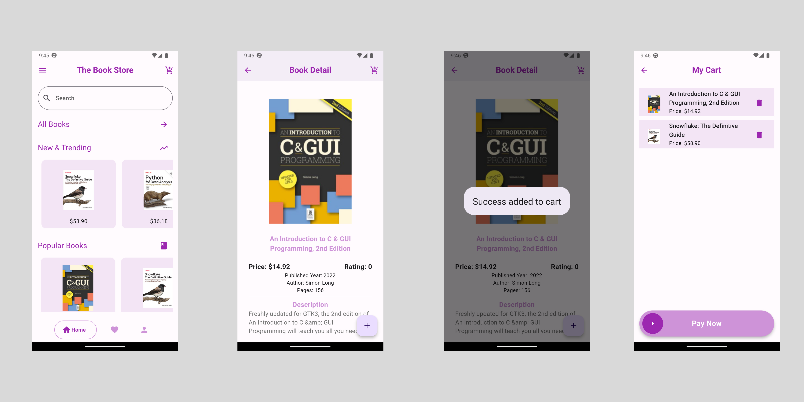
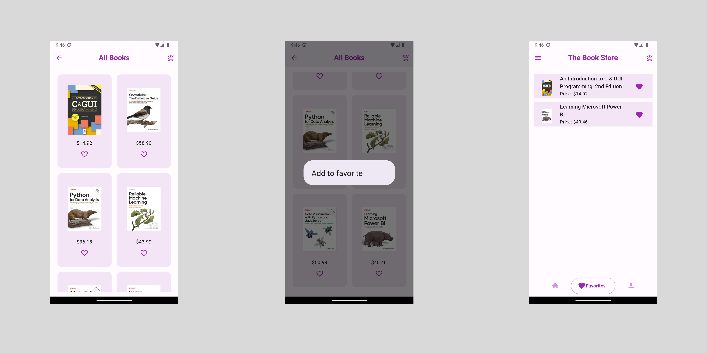

# Shop App

Shopping at home is better!


### Screens




### Features

- add to cart
- remove from cart
- add to favorite
- remove from favorite
- List view builder
- APIs REST (GET)
- API from https://api.itbook.store/
- Popup message
- Much more

### Pakages

- cupertino_icons: ^1.0.2
- go_router: ^8.0.3
- google_nav_bar: ^5.0.6
- http: ^0.13.6
- provider: ^6.0.5
- fancy_shimmer_image: ^2.0.2
- slide_to_act: ^2.0.1


### Author

[Phat Panhareach](https://github.com/Re4ch-Jay/)


### Usage

```bash
# Clone this repository
$ git clone https://github.com/Re4ch-Jay/Book-Store.git

# Install dependencies
$ flutter packages get

# Run the app
$ flutter run
```